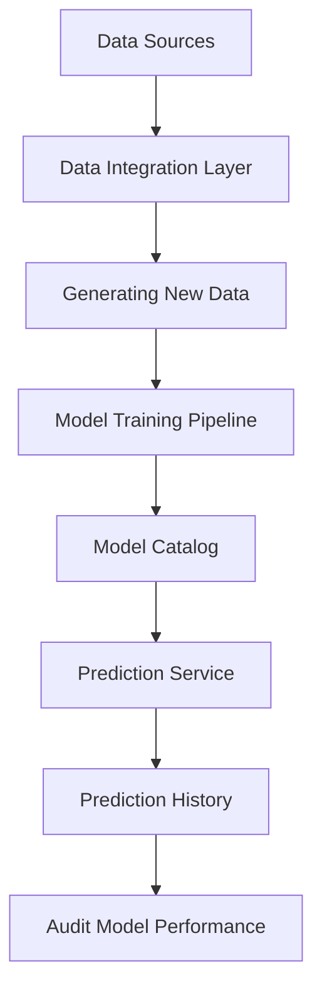

# SecureBank System Report

## Table of Contents
1. [System Design](#system-design)
2. [Data, Data Pipelines, and Model](#data-data-pipelines-and-model)
3. [Metrics Definition](#metrics-definition)
4. [Analysis of System Configurations](#analysis-of-system-configurations)
5. [Post-deployment Policies](#post-deployment-policies)

## System Design

### Meeting Requirements

The SecureBank system was designed to fulfill the following requirements:

1. **R1: Improved Performance**
    - The system incorporates logistic regression, SVM, and random forest models. 5x2 cross-validation is planned to improve model performance, though further exploration is needed for its implementation.

2. **R2: Transaction Prediction**
   - The system employs fraud detection models (logistic regression, SVM, random forest) to classify transactions in real-time, predicting whether they are legitimate or fraudulent.

3. **R3: Dataset Generation**
   - Administrators can generate new datasets using an intuitive interface. The system allows custom selection criteria and various sampling methods to ensure diverse and representative datasets.

4. **R4: Model Selection**
    - Administrators can train specific models or choose from a catalog of pre-trained models (logistic regression, SVM, random forest).

5. **R5: Performance Auditing**
   - An auditing module is provided for administrators to review system performance across key metrics.

### System Components and Processes

The SecureBank system consists of several interconnected components, which are visualized below:

## Data, Data Pipelines, and Model

### Data Description and Significant Patterns

1. **Transaction Data**
   - Contains details such as transaction amount, timestamp, merchant category, and location.
   - Significant patterns: Unusual transaction amounts, high-frequency transactions, transactions from atypical hours and locations.

2. **Customer Profiles**
   - Includes demographic information, account history, and behavioral patterns.
   - Significant patterns: Sudden changes in spending behavior, transactions inconsistent with customer history.

3. **External Fraud Databases**
   - Incorporates fraud reports.
### Data Pipeline Decisions
#### Raw Data Handler

1. **Data Extraction**: We use pandas to read CSV and Parquet files, and the built-in json module for JSON files. This allows for efficient handling of different file formats.

2. **Data Transformation**:
   - Merge dataframes based on common keys (cc_num and trans_num).
   - Standardize column names for consistency.
   - Convert date columns to datetime for easier time-based feature extraction.
   - Create derived features (hour, day_of_week, month) for time-based analysis.
   - Handle missing values in the 'is_fraud' column by filling with 0 (assuming non-fraudulent by default).

3. **Data Description**: We provide a comprehensive description of the dataset, including shape, columns, data types, missing values, and fraud ratio.

4. **Data Loading**: We save the processed data in Parquet format for efficient storage and quick reading in subsequent steps.

- The merging strategy allows us to combine all relevant information from different sources.
- Time-based features are crucial for fraud detection, as fraudulent activities often follow temporal patterns.
- Standardizing column names and handling missing values ensures data consistency and prevents issues in downstream processes.
- Using Parquet format for storage provides a good balance between compression and read performance.

#### Dataset Designer

1. **Data Extraction**: We read the processed raw data from the Parquet file created by the Raw Data Handler.

2. **Data Sampling**:
   - We use a 80-20 split for train-test.
   - We use stratified sampling to maintain the same fraud ratio across all splits.
   - We use customer number to ensure transactions for the same customer goes to the same train-test split

3. **Data Description**: We provide information about the shape and fraud ratio for each partition.

4. **Data Loading**: We save each partition (train, validation, test) as separate Parquet files.

- The 80-20 split is a common practice that provides a good balance between having enough training data and a representative test set.
- Stratified sampling ensures that each partition has a similar distribution of fraudulent and non-fraudulent transactions, which is crucial for model training and evaluation.
- Saving partitions separately allows for easy access in subsequent steps of the machine learning pipeline.

#### Feature Extractor
1. **Data Extraction**: We read the partitioned data (train, validation, test) from the Parquet files created by the Dataset Designer.

2. **Feature Transformation**:
   - Time-based features: We use sine and cosine transformations for hour and day of week to capture cyclical patterns.
   - Transaction amount: We apply log transformation to handle the wide range of transaction amounts.
   - Merchant category: We encode categories as integers.
   - Location-based features: We calculate the Haversine distance between the customer's location and the merchant's location.
   - Feature scaling: We apply standard scaling to normalize feature ranges.

3. **Data Description**: We provide information about the shape, columns, and data types for each feature set and target variable.

- Sine and cosine transformations for time features allow the model to capture cyclical patterns without imposing an arbitrary linear relationship.
- Log transformation of transaction amounts helps to handle the wide range and potential skewness in the data.
- Encoding merchant categories allows the model to work with this categorical data.
- Haversine distance provides a meaningful measure of the distance between the customer and merchant, which could be indicative of fraudulent activity.
- Standard scaling ensures that all features are on a similar scale, which is important for many machine learning algorithms.

### Model Inputs and Outputs

The system supports three models: logistic regression, SVM, and random forest. Inputs include features such as:

- **category**
- **merchant**
- **merch_lat**
- **merch_long**
- **hour_sin**
- **hour_cos**
- **log_amt**
- **rapid_transactions**
- **distance**

Outputs are binary classifications indicating whether a transaction is fraudulent or not.

## Metrics Definition

### Offline Metrics

1. **Precision**
   - **Purpose**: Measures the accuracy of positive predictions, indicating how many of the flagged transactions are actually fraudulent.
   - **Rationale**: High precision is crucial for the SecureBank fraud detection system to minimize the number of legitimate transactions incorrectly marked as fraudulent, thereby enhancing customer trust and satisfaction.

2. **Recall**
   - **Purpose**: Assesses the model's ability to identify all positive instances of fraud.
   - **Rationale**: A high recall ensures that most fraudulent transactions are detected, which is vital for reducing financial losses. Missing fraudulent activities can lead to significant repercussions for the bank and its clients.

3. **F1 Score**
   - **Purpose**: Provides a balanced measure of precision and recall, serving as a single metric to evaluate overall performance.
   - **Rationale**: The F1 score is important for the SecureBank system because it balances the trade-off between precision and recall. This balance helps ensure that the model effectively detects fraud while minimizing false alarms.

### Online Metrics

1. **False Positive Rate (FPR)**
   - **Purpose**: Monitors the rate of legitimate transactions incorrectly flagged as fraudulent.
   - **Rationale**: Keeping the FPR low is essential for maintaining customer satisfaction and trust. High false positive rates can frustrate customers and lead to increased transaction declines.

2. **False Negative Rate (FNR)**
   - **Purpose**: Tracks the rate of fraudulent transactions incorrectly classified as legitimate.
   - **Rationale**: A low FNR is critical for the SecureBank system to ensure that fraudulent activities are caught in real time. High false negatives can result in substantial financial losses and undermine the effectiveness of the fraud detection system.

## Analysis of System Configurations

### Feature Selection

1. **Correlation Analysis**
   - Remove highly correlated features to reduce multicollinearity and ensure that each feature provides unique information.

2. **Feature Importance**
   - Select the top features based on the initial data analysis to focus on the most impactful variables, enhancing model efficiency.

### Selected Features for Final Training
The final features chosen for model training include:

- **category**: Categorical encoding of transaction types (e.g., retail, dining), which can help identify unusual purchases.
- **merchant**: The specific merchant involved in the transaction, encoded as integers.
- **merch_lat** and **merch_long**: Latitude and longitude of the merchant’s location, which can indicate if a transaction is happening in an unusual or high-risk area.
- **hour_sin** and **hour_cos**: Cyclical transformations of the transaction time, capturing temporal patterns of fraudulent transactions that tend to occur at odd hours.
- **log_amt**: Log transformation of the transaction amount to reduce skewness in the data and make it easier for the model to handle a wide range of transaction amounts.
- **rapid_transactions**: A feature that flags when multiple transactions occur within a short time window, which can be a strong indicator of fraud.
- **distance**: The Haversine distance between the customer’s registered location and the merchant’s location, which can reveal anomalous geographic activity.

These selected features encompass transaction details, geographical information, temporal patterns, and customer behavior, all of which are critical for accurately detecting fraud. This balanced feature set allows the models to capture the complex patterns associated with fraudulent transactions.

### Dataset Design

The following approach is used to partition the data:

1. **Group-based Splitting**  
   Fraudulent behavior often clusters around specific customers or accounts, making random dataset splitting risky due to potential data leakage. To mitigate this, we employ **GroupShuffleSplit**, which keeps all transactions associated with a particular customer (identified by the `cc_num`) together in either the training or test set. This method prevents transactions from the same customer from appearing in both sets, which would otherwise inflate the model's performance metrics.

2. **Train-Test Split**  
   An **80-20 train-test split** is implemented while maintaining the same fraud ratio across both sets. This approach ensures that the model is trained on a representative sample of both fraudulent and legitimate transactions, enabling the test set to provide an unbiased evaluation of model performance.

### Analysis of Implementation

The **Dataset Designer** class is pivotal for managing data extraction, sampling, and descriptions. It begins with extracting raw data from a specified location, ensuring that the data is accessible for further processing. The sampling method employs **GroupShuffleSplit** to maintain customer integrity across the train and test sets, preserving the natural distribution of fraud within the data. This design choice enhances the reliability of model evaluation, allowing for better insights into real-world performance.

The description method provides valuable insights into the dataset's characteristics, including shape, fraud ratio, and unique customer counts for both training and test sets. This information is essential for monitoring dataset quality and understanding the model's training environment. Overall, this dataset design framework effectively addresses the challenges of fraud detection and prepares the model for real-world application.

## Model Evaluation and Selection

Model evaluation involves assessing performance using both offline and online metrics to ensure robustness in real-world scenarios.

### Offline Evaluation Process

The offline evaluation focuses on calculating precision, recall, and the F1 score to gauge the model's effectiveness before deployment. Each model is trained and validated on the training set, with performance metrics computed on the test set. This process allows for a comprehensive analysis of how well each model can identify fraudulent transactions while minimizing false positives.

### Online Evaluation Process

Once the model is deployed, online metrics such as the False Positive Rate (FPR) and False Negative Rate (FNR) come into play. These metrics are monitored in real time to evaluate the model's effectiveness in a live environment. Continuous tracking of these rates helps ensure that legitimate transactions are not incorrectly flagged, while fraudulent activities are promptly detected, thereby protecting customer trust and reducing financial losses.

### Model Selection

We compare three models—logistic regression, SVM, and random forest—based on their performance metrics. Logistic regression provides a linear baseline, SVM excels in high-dimensional spaces, and random forest captures complex patterns effectively. Ultimately, random forest is selected as the primary model due to its superior performance across both offline and online evaluations, making it the most robust choice for fraud detection.

## Post-deployment Policies

### Monitoring and Maintenance Plan

1. **Real-time Performance Monitoring**
   - Implement performance auditor metrics including false positive rate, average response time, and alert rate.
   - Set up automated alerts for metric deviations beyond predefined thresholds.

2. **Model Health Checks**
   - Conduct daily evaluations of model performance on the most recent data.
   - Perform weekly in-depth analyses of model predictions and feature importances.

3. **Data Quality Monitoring**
   - Implement automated checks for data consistency, completeness, and drift.
   - Set up alerts for significant changes in data distributions or unexpected missing values.

4. **Regulatory Compliance Checks**
   - Conduct monthly audits to ensure adherence to financial regulations and data protection laws.
   - Maintain detailed logs of model decisions for regulatory reporting and audits.

### Fault Mitigation Strategies

1. **Model Fallback Mechanism**
   - Implement a simple, rule-based system as a fallback in case of model failure.
   - Ensure seamless switching between primary and fallback systems with minimal downtime.

2. **Data Pipeline Redundancy**
   - Set up parallel data processing pipelines to prevent single points of failure.
   - Implement data checkpointing and recovery mechanisms for pipeline failures.

3. **Gradual Model Updates**
   - Utilize canary deployments for new model versions, routing a small percentage of traffic initially.
   - Implement automatic rollback procedures if new model performance degrades.

4. **Disaster Recovery Plan**
   - Maintain up-to-date backups of all system components and data.
   - Conduct regular disaster recovery drills to ensure minimal recovery time objectives (RTO) and recovery point objectives (RPO).

5. **Incident Response Protocol**
   - Establish a clear incident response team and communication channels.
   - Develop and regularly update playbooks for common failure scenarios.